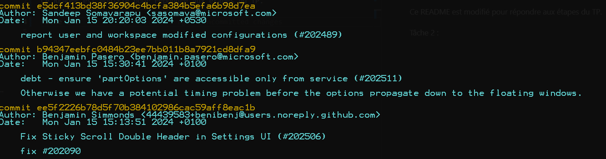

# Visual Studio TP
## TP 1
Ce README est modifié pour répondre aux étapes du TP.

### Tâche 1 :
Si vous voyez ce dépôt c'est que le clone est ok :rocket:

### Tâche 2 :

Quelques exemple de commit au sein du projet VScode listé via `git log`

On voit plusieurs type de commits tels que:
- fix
- debt - ensure
- Git
- zoom
- Patch

### Tâche 3 :

Pour créer une nouvelle branche j'entre la commande `git checkout -b tp/new-branch-1` ainsi cela me place automatiquement dessus après la création.

## TP 2
### Tâche 1 :
La plupart des commit ont un titre parlant notamment `Remove pythob setu^from CI`, `Fix failing test due to the relative path output of minitest` ou encore `Add test for after_routes_loaded`. Les merge pull request sont associé à la référence de la pull request en question et de plus le titre de la pull request est également présent.

### Tâche 2 :
Dans le dépôt on voit le système de cersionning répondant aux standards de version :

Il y a également un fichier changelog situé dans le répertoire `/guides` renvoyant au différents changelog.md stipulant tout les changements apportés lors des différents changements de versions.

La présence d'un ReadMe détaillé est également à noter.

## TP 3
### Tâche 1 :
Pour réaliser cette étape j'ai créé une nouvelle branche via `git checkout -b feature/branch-feature-1`
Je vais ensuite fusionner la branche avec la branche de base qui est `tp/new-branch-1`
